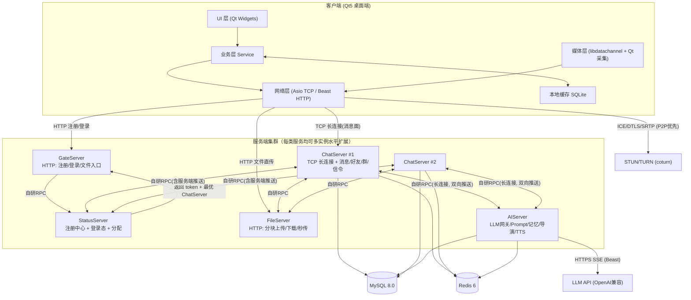
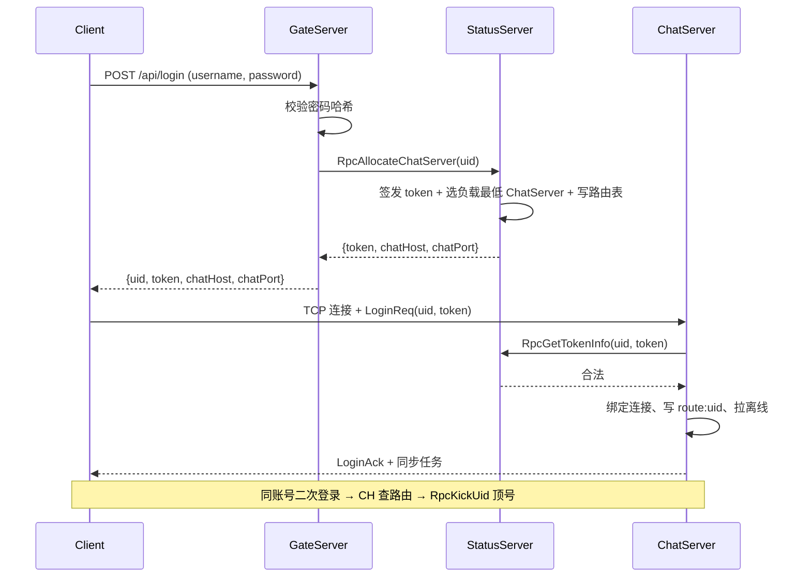
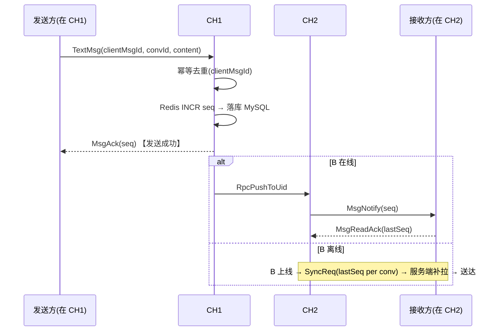

# 01 系统架构设计

> 版本：v1.0 ｜ 日期：2026-10-05 ｜ 前置文档：[00-项目总览与术语](00-项目总览与术语.md)

---

## 1. 总体拓扑



## 2. 接入模型：为什么 Gate 只做 HTTP，客户端直连 ChatServer

**决策**：GateServer 只承担 HTTP 注册 / 登录（含文件接口入口），登录成功后由 StatusServer
分配一个 ChatServer，客户端**直接与该 ChatServer 建立 TCP 长连接**承载全部消息面。

| 方案 | 优点 | 缺点 |
| --- | --- | --- |
| A. Gate 作为 TCP 代理隧道（所有流量过 Gate） | 接入层可统一做 TLS、限流；客户端地址单一 | Gate 成为消息面瓶颈与单点；多一跳延迟；连接状态迁移复杂 |
| B. Gate 仅 HTTP，客户端直连 ChatServer（**采用**） | 消息面无中间跳数；ChatServer 可独立水平扩容；架构简单清晰 | 客户端需要"先 HTTP 再 TCP"两步；公网需暴露多个端口 |

> 面试考点：QQ/微信同类架构（接入层与逻辑层分离）。为什么 IM 不把消息面放在 HTTP 网关后面？
> ——长连接推模型、低延迟、服务端主动推送，都要求每台逻辑服务器直接持有连接。

## 3. 各服务职责明细

### 3.1 GateServer（接入网关）

- Boost.Beast 实现 HTTP Server：
  - `POST /api/register`：用户名查重、密码加盐哈希入库；
  - `POST /api/login`：校验密码 → 调 StatusServer 签发 token、分配 ChatServer → 返回 `{uid, token, chatServerHost, chatServerPort, selfInfo}`；
  - 反向代理 FileServer 的可选入口（公网只暴露 Gate 一个 HTTP 端口时使用）。
- 无状态，可水平扩展（前面挂 Nginx 做负载均衡，本机已有 Nginx 可复用）。
- 防护：接口限流（IP 维度令牌桶）、验证码位（首期预留接口）。

### 3.2 StatusServer（注册中心 + 登录态）

- **服务注册表**：所有服务启动时 RPC `Register`（serverType/id/host/port/load），心跳续期（30s×3 失败摘除）；
- **token 签发与校验**：HMAC-SHA256 签名 token（`uid.expire.hmac`），无状态可校验；
- **ChatServer 分配**：按 Redis 中各节点连接数取最小者，写 `load:chatserver:{id}`；
- **在线路由表**（配合 Redis）：`route:uid:{uid} → chatServerId`，供跨节点投递查询。

### 3.3 ChatServer（消息核心节点）

- 持有客户端 TCP 长连接（Asio + 自研协议帧）：心跳、粘包处理、断线重连；
- 单聊 / 群聊消息：持久化（先落库再投递）、seq 分配（Redis INCR + MySQL 权威）、ACK、离线拉取；
- 好友 / 群组业务逻辑与通知推送；
- 音视频通话信令中转（详见 05 文档）；
- 识别 AI 会话 → RPC 提交 AIServer，接收其流式推送并转发客户端；
- 跨节点投递：目标不在线或不在本机 → 查 Redis 路由 → RPC `PushToUid` 转发至目标 ChatServer。

### 3.4 FileServer（文件节点）

- Boost.Beast HTTP：分块上传（4MB/块）、秒传（MD5 秒传索引）、断点续传（已收块位图）、下载（Range 支持）、图片缩略图；
- 存储布局见 [03-数据库与存储设计](03-数据库与存储设计.md)；腾讯云 COS（本机已有 SDK）作为云端对象存储的可选后端，存储接口抽象 `IFileStorage`。

### 3.5 AIServer（酒馆节点，详见 04 文档）

- 仅 RPC 接入，不直接面向客户端；
- Prompt 组装（人设 + 世界书 + 记忆 + 上下文窗口）→ LLM 网关（Beast HTTPS + SSE 流式）→
  流式分片推送回 ChatServer → 生成完成回写 MySQL；
- 附属能力：记忆摘要任务、导演调度、好感度结算、TTS 合成、Swipe 重掷。

## 4. 自研 RPC 设计（Protobuf + Asio）

### 4.1 总体

- 所有内部调用统一走 `RpcChannel`：Asio 长连接 + 连接池（每目标服务 1~4 条）+ 自动重连；
- 复用与客户端一致的帧头（见 02 文档），追加 RPC 头：`serviceId(u16) | methodId(u16) | requestId(u32) | flags(u8)`；
- `requestId` 匹配请求与响应；基于 `std::future` / 回调两种风格的客户端 API；
- **服务端推送（Push）**：ChatServer↔AIServer 之间保持双向长连接，AIServer 生成分片后以
  `flags=0x02` 的 RPC Push 帧主动推送（LLM 流式输出的关键通道）。

### 4.2 服务发现与注册

```
启动 → RPC Register(type,id,host,rpcPort,load) → StatusServer 内存注册表 + Redis 快照
运行 → 每 30s 心跳续期 → 连续 3 次失败 → 摘除 + 广播变更
调用 → 本地缓存服务表(内存, 订阅变更) → 负载均衡选择节点 → 连接池发请求
```

### 4.3 负载均衡与容错

- 策略：最小连接数（ChatServer 分配）+ 随机（无状态调用）；
- 超时：普通调用 3s；LLM 编排调用为异步任务制，不走同步 RPC 等待；
- 重试：仅幂等方法（查询类）自动重试 1 次；写方法靠 requestId 幂等去重；
- 熔断：单节点连续 N 次超时 → 短期摘除（本地熔断标记，半开恢复）。

### 4.4 方法清单（首期）

| serviceId | 服务 | 关键方法 |
| --- | --- | --- |
| 0x01 | StatusServer | Register / Heartbeat / GetTokenInfo / AllocateChatServer |
| 0x02 | ChatServer | PushToUid / KickUid / GetOnlineInfo |
| 0x03 | FileServer | GetUploadTicket / ConfirmUpload / GetDownloadUrl |
| 0x04 | AIServer | SubmitChat / SubmitSwipe / SubmitStoryTurn / SubmitSummaryTask / PushStreamChunk / PushStreamEnd |

## 5. 关键数据流

### 5.1 登录（时序）



### 5.2 单聊消息（在线/离线）



### 5.3 AI 消息（酒馆，简版；完整版见 04 文档）

```
Client → ChatServer: TextMsg(发给 AI uid)
ChatServer: 落库(seq 照常) → 目标为 AI → Rpc SubmitChat(convId, ...) → 立即 MsgAck 给用户
AIServer: 组装 Prompt → LLM SSE 流式
AIServer --Push--> ChatServer: AI_TYPING → AI_STREAM_CHUNK × N → AI_STREAM_END(全文+好感度)
ChatServer: 收到 END 后以最终全文落库(同一条消息的 AI 消息 seq) → 转发分片与最终消息给用户
```

### 5.4 文件上传

```
Client → FileServer: GET /api/file/ticket (md5 预检, 经 Gate 或直连)
  ├─ 秒传命中 → 返回 fid，直接发文件消息
  └─ 未命中 → 分块 PUT(4MB, 带块号与位图) → 全部到齐 → ConfirmUpload 合并 → 返回 fid
Client → ChatServer: FileMsg(fid, name, size, mime) 走普通消息管线
```

## 6. 部署拓扑与端口规划（开发环境单机多进程）

| 进程 | 端口 | 协议 | 说明 |
| --- | --- | --- | --- |
| GateServer | 8080 | HTTP | 注册/登录 API |
| StatusServer | 9000 | 自研RPC | 注册中心/登录态 |
| ChatServer #1 | 8888（客户端TCP）/ 9001（RPC） | TCP | 可复制进程改端口横向扩展 |
| ChatServer #2 | 8889 / 9002 | TCP | 压测与跨节点联调用 |
| FileServer | 8085 | HTTP | 文件上传下载 |
| AIServer | 9003 | 自研RPC | 酒馆节点 |
| MySQL | 3306 | - | 已就绪 |
| Redis | 6379 | - | 已就绪 |
| coturn（M5） | 3478/5349 | STUN/TURN | M5 阶段部署 |

配置统一走 `config/*.json`（服务名同名文件），包含监听端口、DB/Redis 连接、日志路径、LLM Key（不入库不入 git，`*.local.json` 覆盖）。

## 7. 客户端分层架构（为 Android 预留的关键设计）

```mermaid
flowchart TB
    subgraph L1 ["ui/ 界面层 (Qt Widgets, 可整体替换)"]
        LoginWin / MainPanel / ChatWindow / RoleCardEditor / Discovery
    end
    subgraph L2 ["service/ 业务层 (纯C++, 无Qt依赖*  )"]
        AccountService / FriendService / ConversationService / MediaService / TavernService
    end
    subgraph L3 ["net/ 网络层 (纯C++)"]
        TcpClient(Asio) / HttpManager(Beast) / ProtocolCodec / ReconnectPolicy
    end
    subgraph L4 ["media/ 媒体层"]
        AudioCapture(Qt) / VideoCapture(Qt) / WebRtcPeer(libdatachannel) / Player(FFmpeg)
    end
    subgraph L5 ["data/ 本地数据层"]
        SQLite(消息/会话缓存) / Settings(QSettings) / FileCache
    end
    L1 --> L2 --> L3
    L1 --> L4
    L2 --> L5
```

> \* 业务层允许使用 QString/Qt 容器但不触碰任何 QWidget；接口均以信号槽/回调暴露。
> Android 端策略：复用 net/ + protocol/ + 业务逻辑的纯 C++ 核心，UI 用 Qt for Android 或原生重写（M8 出评估文档）。

- 客户端线程模型：主线程（UI）+ IO 线程（Asio io_context，1~2 个）+ 业务线程池；跨线程统一经队列投递回 UI 线程（信号槽 QueuedConnection）。
- 心跳 30s；重连指数退避（1s 起步 ×2，上限 60s，抖动 ±20%）；重连成功后按本地 SQLite 最大 seq 补拉。

## 8. 仓库目录结构

```
NewChat/
├── CMakeLists.txt              # 根构建脚本（vcpkg 工具链接入点）
├── vcpkg.json                  # 依赖清单（protobuf, spdlog, hiredis, gtest, libdatachannel...）
├── client/                     # Qt5 桌面客户端
│   ├── ui/                     # 界面层（Widgets）
│   ├── service/                # 业务层
│   ├── net/                    # 网络层（Asio/Beast）
│   ├── media/                  # 媒体层（libdatachannel/FFmpeg/Qt采集）
│   ├── data/                   # SQLite 缓存、设置
│   └── main.cpp
├── server/
│   ├── common/                 # 公共库：日志/配置/线程池/连接池/BufReader(RPC与协议共用)/MySQL池/Redis池/RPC框架
│   ├── gateserver/
│   ├── statusserver/
│   ├── chatserver/
│   ├── fileserver/
│   └── aiserver/               # 酒馆：llmgateway/ promptbuilder/ lorebook/ memory/ director/ tts/
├── proto/                      # *.proto（平台无关）
├── tools/
│   ├── simbot/                 # C++ 协议机器人（压测/自动化回归）
│   └── scripts/                # Python 辅助脚本（建库、造数、协议黄金用例）
├── docs/                       # 本文档集 + tests/ + devlog/
└── third_party/                # 个别不便进 vcpkg 的库
```

## 9. 编码规范细则（强约束）

### 9.1 命名（驼峰法）

| 对象 | 规则 | 示例 |
| --- | --- | --- |
| 类 / 结构 / 枚举类型 / 文件名 | 大驼峰 PascalCase | `ChatServer`、`MessageManager`、`MessageManager.h/.cpp` |
| 函数 / 方法 / 变量 / 参数 | 小驼峰 camelCase | `sendMessage()`、`connPool`、`maxRetryCount` |
| 类成员变量 | 小驼峰 + `m_` 前缀 | `m_userId`、`m_isOnline` |
| 常量（constexpr/const） | `k` + 大驼峰 | `kMaxRetry`、`kHeartbeatIntervalSec` |
| 宏 / 枚举值 | 全大写下划线 | `LINGXI_VERSION`、`MSG_TEXT` |
| protobuf 消息 | 大驼峰，字段 snake_case（proto 惯例） | `TextMessage`、`conv_id` |
| MySQL 表/列 | `t_` 前缀 + snake_case | `t_message`、`conv_id` |

### 9.2 注释（Doxygen，强约束）

```cpp
/**
 * @brief 单聊消息管理器：负责消息的发送、去重、ACK 与离线补拉。
 *
 * 线程安全性：所有公开方法线程安全；内部通过 m_strand 串行化对会话状态的访问。
 */
class MessageManager {
public:
    /**
     * @brief 发送文本消息到指定会话。
     * @param convId   目标会话 ID
     * @param content  文本内容（UTF-8）
     * @param callback 发送结果回调，参数为 (seq, errCode)；seq 为服务端分配的会话序号
     * @return 客户端消息幂等 ID（UUID），用于去重与撤回
     */
    std::string sendTextMessage(int64_t convId, const std::string& content,
                                SendCallback callback);
private:
    mutable asio::strand<asio::io_context::executor_type> m_strand; ///< 串行化会话状态访问
};
```

- 每个类、每个成员函数（含参数/返回值）、重要成员变量必须有 Doxygen 注释；
- 协议字段、数据库字段、AI Prompt 组装逻辑这类「跨端契约」处，注释必须与 02/03/04 文档同步；
- 「为什么这样写」的决策性注释优于「做了什么」的流水账注释。

### 9.3 其他

- C++17 标准（libdatachannel 与 Boost 1.90 均要求 ≥17）；
- 智能指针优先，裸指针仅用于 Qt 父子对象树；Qt 对象遵循父子所有权；
- 错误处理：网络层用错误码 + 日志；业务层用 `Result<T>` 风格轻量模板；
- 日志：spdlog，格式 `[%Y-%m-%d %H:%M:%S.%e][%l][%t][%s:%#] %v`，滚动文件 + 控制台双输出；
- 每个里程碑合并前：`clang-format`（.clang-format 基于 Google 风格 + 驼峰规则）+ 全部单测通过。

## 10. 水平扩展与演进路线

1. **当前（M0~M8）**：单机多进程，全部服务可多开（端口区分），Redis 路由表已支持跨 ChatServer 投递；
2. **阶段二**：Nginx 前置 Gate（本机已有 nginx-rtmp 可复用）；消息表按 `hash(conv_id)` 分表；
   StatusServer 主备（注册表 Redis 化后无状态化）；
3. **阶段三**：引入消息队列（离线推送削峰、AI 任务解耦）、大群读扩散、多机房部署、
   链路追踪（自研 traceId 贯穿 RPC）。

各阶段具体触发指标（连接数/QPS/表容量）见 [07-测试计划](07-测试计划与记录.md) 压测章节。
