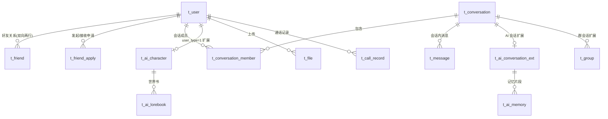

# 03 数据库与存储设计

> 版本：v1.0 ｜ 数据库：MySQL 8.0（InnoDB，utf8mb4）｜ 缓存：Redis 6
> 命名：表 `t_` 前缀 snake_case；所有表含 `created_at`，可变数据表含 `updated_at`。

---

## 1. 数据域总览



会话模型核心：**一切对话（单聊/群聊/AI单聊/剧情群）统一为 `t_conversation`**，
单聊由 `member_key`（两个 uid 排序拼接）唯一约束防重；消息统一落 `t_message`。

## 2. MySQL 表结构（DDL）

### 2.1 用户与关系

```sql
CREATE TABLE t_user (
  id            BIGINT UNSIGNED PRIMARY KEY,          -- 雪花 ID（不使用自增，见 §5.1）
  username      VARCHAR(32)  NOT NULL,
  password_hash CHAR(64)    NOT NULL,                 -- SHA256(salt + password)
  salt          CHAR(32)     NOT NULL,                -- 16 字节盐 → 32 hex
  nickname      VARCHAR(32)  NOT NULL,
  avatar_fid    VARCHAR(32)  NOT NULL DEFAULT '',      -- 头像文件 ID（空=默认头像）
  signature     VARCHAR(128) NOT NULL DEFAULT '',
  gender        TINYINT      NOT NULL DEFAULT 0,       -- 0 未知 1 男 2 女
  user_type     TINYINT      NOT NULL DEFAULT 0,       -- 0 真人 1 AI 角色（ADR-011）
  status        TINYINT      NOT NULL DEFAULT 0,       -- 0 正常 1 禁用
  created_at    DATETIME     NOT NULL DEFAULT CURRENT_TIMESTAMP,
  updated_at    DATETIME     NOT NULL DEFAULT CURRENT_TIMESTAMP ON UPDATE CURRENT_TIMESTAMP,
  UNIQUE KEY uk_username (username),
  KEY idx_type (user_type)
) ENGINE=InnoDB DEFAULT CHARSET=utf8mb4 COMMENT='用户表（真人+AI角色统一）';

CREATE TABLE t_friend (
  id         BIGINT UNSIGNED PRIMARY KEY,             -- 雪花 ID
  uid        BIGINT UNSIGNED NOT NULL,
  friend_uid BIGINT UNSIGNED NOT NULL,
  remark     VARCHAR(32)  NOT NULL DEFAULT '',        -- 好友备注
  group_name VARCHAR(32)  NOT NULL DEFAULT '我的好友',-- 分组名
  source     TINYINT      NOT NULL DEFAULT 0,         -- 0 搜索 1 名片/广场 2 群
  created_at DATETIME     NOT NULL DEFAULT CURRENT_TIMESTAMP,
  UNIQUE KEY uk_pair (uid, friend_uid),               -- 双向各一行：A→B 与 B→A
  KEY idx_friend (friend_uid)
) ENGINE=InnoDB DEFAULT CHARSET=utf8mb4 COMMENT='好友关系表';

CREATE TABLE t_friend_apply (
  id         BIGINT UNSIGNED PRIMARY KEY,
  from_uid   BIGINT UNSIGNED NOT NULL,
  to_uid     BIGINT UNSIGNED NOT NULL,
  verify_msg VARCHAR(128) NOT NULL DEFAULT '',
  status     TINYINT      NOT NULL DEFAULT 0,         -- 0 待处理 1 同意 2 拒绝 3 过期
  created_at DATETIME     NOT NULL DEFAULT CURRENT_TIMESTAMP,
  handled_at DATETIME     NULL,
  KEY idx_to_status (to_uid, status)
) ENGINE=InnoDB DEFAULT CHARSET=utf8mb4 COMMENT='好友申请表';
```

### 2.2 会话与消息（核心）

```sql
CREATE TABLE t_conversation (
  id          BIGINT UNSIGNED PRIMARY KEY,            -- 雪花 ID
  type        TINYINT      NOT NULL,                  -- 1 单聊 2 群聊 3 AI单聊 4 剧情群
  member_key  VARCHAR(64)  NOT NULL DEFAULT '',       -- 单聊: "minUid_maxUid"；群聊为空
  name        VARCHAR(64)  NOT NULL DEFAULT '',       -- 群名；单聊为空
  owner_uid   BIGINT UNSIGNED NOT NULL DEFAULT 0,
  last_seq    BIGINT UNSIGNED NOT NULL DEFAULT 0,     -- 冗余最后 seq，会话列表加速
  last_msg_at DATETIME     NULL,
  created_at  DATETIME     NOT NULL DEFAULT CURRENT_TIMESTAMP,
  UNIQUE KEY uk_member_key (member_key),
  KEY idx_owner (owner_uid)
) ENGINE=InnoDB DEFAULT CHARSET=utf8mb4 COMMENT='会话表（单聊/群聊/AI统一）';

CREATE TABLE t_conversation_member (
  conv_id       BIGINT UNSIGNED NOT NULL,
  uid           BIGINT UNSIGNED NOT NULL,
  role          TINYINT      NOT NULL DEFAULT 2,      -- 0 群主 1 管理员 2 成员
  last_read_seq BIGINT UNSIGNED NOT NULL DEFAULT 0,   -- 已读游标（未读数 = last_seq - last_read_seq）
  muted_until   DATETIME     NULL,
  joined_at     DATETIME     NOT NULL DEFAULT CURRENT_TIMESTAMP,
  PRIMARY KEY (conv_id, uid),
  KEY idx_uid (uid)                                   -- 查「我的会话列表」
) ENGINE=InnoDB DEFAULT CHARSET=utf8mb4 COMMENT='会话成员表（含已读游标）';

CREATE TABLE t_message (
  conv_id       BIGINT UNSIGNED NOT NULL,
  seq           BIGINT UNSIGNED NOT NULL,               -- 会话内序号，与 conv_id 构成逻辑主键
  msg_id        BIGINT UNSIGNED NOT NULL,               -- 雪花 ID（全局唯一，撤回/引用寻址用）
  client_msg_id CHAR(36)     NOT NULL,                  -- 幂等 ID
  from_uid      BIGINT UNSIGNED NOT NULL,               -- 旁白=0
  msg_type      TINYINT      NOT NULL,
  status        TINYINT      NOT NULL DEFAULT 0,        -- 0 正常 1 撤回 2 生成中 3 截断
  payload       JSON         NOT NULL,                  -- 02 文档 §3.2 JSON 信封（含 AI versions）
  created_at    DATETIME(3)  NOT NULL DEFAULT CURRENT_TIMESTAMP(3),
  PRIMARY KEY (conv_id, seq),                         -- 按 (conv_id, seq) 有序读写
  UNIQUE KEY uk_client (conv_id, client_msg_id),      -- 幂等去重
  KEY idx_msg_id (msg_id),
  KEY idx_from_time (from_uid, created_at)            -- 按人查历史（如撤回校验）
) ENGINE=InnoDB DEFAULT CHARSET=utf8mb4 COMMENT='消息表（分表演进见 §5.3）';
```

> 设计取舍（面试高频）：
> - 主键 `(conv_id, seq)` 使「按会话拉区间消息」为聚簇索引顺序读；
> - `member_key` 唯一键让单聊会话「找到即复用」，避免重复建会话；
> - 未读数不建计数器表，用 `last_seq - last_read_seq` 推导，天然一致。

### 2.3 群组扩展

```sql
CREATE TABLE t_group (
  conv_id      BIGINT UNSIGNED PRIMARY KEY,            -- 与会话同 ID
  name         VARCHAR(64)  NOT NULL,
  avatar_fid   VARCHAR(32)  NOT NULL DEFAULT '',
  announcement VARCHAR(512) NOT NULL DEFAULT '',
  group_type   TINYINT      NOT NULL DEFAULT 0,        -- 0 普通群 1 剧情群（酒馆）
  max_member   INT          NOT NULL DEFAULT 200,
  created_at   DATETIME     NOT NULL DEFAULT CURRENT_TIMESTAMP
) ENGINE=InnoDB DEFAULT CHARSET=utf8mb4 COMMENT='群资料表';
-- 群成员复用 t_conversation_member
```

### 2.4 文件

```sql
CREATE TABLE t_file (
  fid        VARCHAR(32)  PRIMARY KEY,                 -- 雪花 ID 十六进制
  md5        CHAR(32)     NOT NULL,                    -- 秒传索引
  file_name  VARCHAR(255) NOT NULL,
  size       BIGINT       NOT NULL,
  mime       VARCHAR(64)  NOT NULL DEFAULT '',
  storage    TINYINT      NOT NULL DEFAULT 0,          -- 0 本地盘 1 腾讯 COS（预留）
  ref_count  INT          NOT NULL DEFAULT 1,          -- 引用计数（全部为 0 时可物理清理）
  uploader   BIGINT UNSIGNED NOT NULL,
  created_at DATETIME     NOT NULL DEFAULT CURRENT_TIMESTAMP,
  KEY idx_md5 (md5, size)                              -- 秒传：同 md5 且同 size 才可信
) ENGINE=InnoDB DEFAULT CHARSET=utf8mb4 COMMENT='文件元数据表';
```

### 2.5 登录态与设置

```sql
CREATE TABLE t_login_session (
  id         BIGINT UNSIGNED PRIMARY KEY,
  uid        BIGINT UNSIGNED NOT NULL,
  token      CHAR(64)     NOT NULL,
  device_id  VARCHAR(64)  NOT NULL DEFAULT '',
  login_ip   VARCHAR(45)  NOT NULL DEFAULT '',
  created_at DATETIME     NOT NULL DEFAULT CURRENT_TIMESTAMP,
  KEY idx_uid (uid, created_at)
) ENGINE=InnoDB DEFAULT CHARSET=utf8mb4 COMMENT='登录流水（审计用；token 热数据在 Redis）';

CREATE TABLE t_call_record (
  id           BIGINT UNSIGNED PRIMARY KEY,
  conv_id      BIGINT UNSIGNED NOT NULL,
  caller_uid   BIGINT UNSIGNED NOT NULL,
  callee_uid   BIGINT UNSIGNED NOT NULL,
  media_type   TINYINT      NOT NULL,                 -- 1 音频 2 视频
  state        TINYINT      NOT NULL,                 -- 0 未接 1 已接 2 拒绝 3 取消 4 异常
  duration_sec INT          NOT NULL DEFAULT 0,
  created_at   DATETIME     NOT NULL DEFAULT CURRENT_TIMESTAMP,
  KEY idx_caller (caller_uid, created_at),
  KEY idx_callee (callee_uid, created_at)
) ENGINE=InnoDB DEFAULT CHARSET=utf8mb4 COMMENT='通话记录表';
```

### 2.6 酒馆（Tavern）扩展表（详见 04 文档）

```sql
CREATE TABLE t_ai_character (
  uid            BIGINT UNSIGNED PRIMARY KEY,          -- 即 t_user.id（user_type=1）
  card_version   VARCHAR(16)  NOT NULL DEFAULT 'v2',   -- 兼容 SillyTavern V2 规范
  name           VARCHAR(64)  NOT NULL,
  description    TEXT         NULL,                    -- 人物设定
  personality    TEXT         NULL,                    -- 性格摘要
  scenario       TEXT         NULL,                    -- 场景设定
  first_mes      TEXT         NULL,                    -- 开场白（添加好友后 AI 主动发出）
  mes_example    TEXT         NULL,                    -- 示例对话
  system_prompt  TEXT         NULL,                    -- 覆盖默认 system（可空）
  creator_notes  VARCHAR(512) NULL,
  tags           JSON         NULL,
  card_fid       VARCHAR(32)  NOT NULL DEFAULT '',     -- 原始 PNG 卡（供导出/分享）
  visibility     TINYINT      NOT NULL DEFAULT 0,      -- 0 私有 1 广场公开
  owner_uid      BIGINT UNSIGNED NOT NULL DEFAULT 0,   -- 创建者（系统内置=0）
  created_at     DATETIME     NOT NULL DEFAULT CURRENT_TIMESTAMP,
  updated_at     DATETIME     NOT NULL DEFAULT CURRENT_TIMESTAMP ON UPDATE CURRENT_TIMESTAMP
) ENGINE=InnoDB DEFAULT CHARSET=utf8mb4 COMMENT='AI 角色卡（SillyTavern V2 兼容）';

CREATE TABLE t_ai_lorebook (
  id         BIGINT UNSIGNED PRIMARY KEY,
  owner_type TINYINT      NOT NULL,                   -- 1 角色私有 2 会话共享 3 全局
  owner_id   BIGINT UNSIGNED NOT NULL,                -- 角色 uid / conv_id
  name       VARCHAR(64)  NOT NULL,
  entries    JSON         NOT NULL,                   -- 词条数组（结构见 04 文档 §4）
  created_at DATETIME     NOT NULL DEFAULT CURRENT_TIMESTAMP,
  KEY idx_owner (owner_type, owner_id)
) ENGINE=InnoDB DEFAULT CHARSET=utf8mb4 COMMENT='世界书（词条触发注入）';

CREATE TABLE t_ai_conversation_ext (
  conv_id             BIGINT UNSIGNED PRIMARY KEY,
  mode                TINYINT      NOT NULL DEFAULT 1, -- 1 陪伴闲聊 2 剧情演绎
  director_enabled    TINYINT      NOT NULL DEFAULT 0, -- 剧情群导演开关
  affinity            INT          NOT NULL DEFAULT 0, -- 好感度数值
  affinity_stage      VARCHAR(16)  NOT NULL DEFAULT '陌生',
  memory_summary      MEDIUMTEXT   NULL,               -- 滚动摘要（旧记忆压缩）
  last_summarized_seq BIGINT UNSIGNED NOT NULL DEFAULT 0,
  updated_at          DATETIME     NOT NULL DEFAULT CURRENT_TIMESTAMP ON UPDATE CURRENT_TIMESTAMP
) ENGINE=InnoDB DEFAULT CHARSET=utf8mb4 COMMENT='AI 会话扩展（好感度/记忆游标/导演）';

CREATE TABLE t_ai_memory (
  id         BIGINT UNSIGNED PRIMARY KEY,
  conv_id    BIGINT UNSIGNED NOT NULL,
  summary    TEXT         NOT NULL,                    -- 该片段摘要
  facts      JSON         NULL,                        -- 关键事实抽取 [{"k":"约定","v":"周六看流星雨"}]
  start_seq  BIGINT UNSIGNED NOT NULL,
  end_seq    BIGINT UNSIGNED NOT NULL,
  created_at DATETIME     NOT NULL DEFAULT CURRENT_TIMESTAMP,
  KEY idx_conv (conv_id, start_seq)
) ENGINE=InnoDB DEFAULT CHARSET=utf8mb4 COMMENT='AI 长期记忆片段';
```

## 3. Redis Key 设计

| Key 模式 | 类型 | TTL | 用途 |
| --- | --- | --- | --- |
| `auth:token:{uid}` | string | 7d | 当前有效 token（登录/重连校验，顶号时覆盖） |
| `route:uid:{uid}` | string | 120s | 在线路由：该用户所在 ChatServer id（心跳续期） |
| `load:chatserver:{id}` | string(hash) | - | 各 ChatServer 连接数（StatusServer 分配依据） |
| `seq:conv:{convId}` | string(int) | 永久 | 会话 seq 计数器（INCR 分配，落库后写回对齐，见 §3.4） |
| `dedup:{convId}:{clientMsgId}` | string | 24h | 消息幂等去重 |
| `conv:members:{convId}` | set | 1h | 群成员缓存（投递扇出用，变更时删除） |
| `conv:meta:{convId}` | hash | 1h | 会话类型/成员 uid 集摘要（投递路由快查） |
| `nonce:{nonce}` | string | 5min | HTTP 防重放 nonce |
| `lock:ai:conv:{convId}` | string | 30s | AI 生成/摘要/导演互斥锁（SET NX PX） |
| `ai:pending:{convId}` | list | 24h | AI 待生成任务（AIServer 崩溃恢复队列） |
| `ratelimit:{uid}:{api}` | string(int) | 窗口期 | 简单滑动窗口限流 |

## 3.4 seq 一致性策略（重点）

1. 分配：`INCR seq:conv:{id}` → 得到本条 seq → 落 MySQL；
2. 兜底：MySQL `PRIMARY KEY(conv_id, seq)` 冲突（仅 Redis 数据丢失回档时可能发生）→
   以 `MAX(seq)+1` 重新分配、回写 Redis、触发告警日志；
3. Redis 持久化：开启 AOF everysec；冷启动若 key 不存在，以 MySQL `MAX(seq)` 惰性初始化；
4. 面试考点：为什么不用 MySQL 自增/批量号段？—— 会话级 INCR 粒度小、天然单调、
   无中心瓶颈；号段方案是全局 msg_id 的备选，本项目全局 ID 用雪花算法（§5.1）。

## 4. 文件存储布局（FileServer）

```
data/files/                    # 根目录（config 指定）
├── blobs/{fid[0:2]}/{fid[2:4]}/{fid}      # 原始文件，两级散列目录防单目录过大
├── chunks/{uploadId}/{blockIndex}         # 分块暂存区（合并后清理）
└── thumbs/{fid[0:2]}/{fid}_w200.jpg       # 缩略图（图片消息）
```

- 上传流程：`POST /api/file/preflight {md5,size}` → 秒传命中返回 fid；
  未命中返回 `uploadId + 已存在块位图`（断点续传）→ `PUT /api/file/chunk` 逐块上传 →
  `POST /api/file/complete` 校验 MD5、合并、入库、清理暂存；
- 下载：`GET /api/file/{fid}?token=…&exp=…`（短时效签名，防盗链）；
- 头像/图片缩略图在上传完成时同步生成（FFmpeg/StbImage）。

## 5. 全局 ID 与容量演进

### 5.1 雪花 ID

`41 位毫秒时间戳 | 10 位机器号（配置） | 12 位序列`，单机单进程内加锁/原子分配；
用途：uid、gid（=conv_id）、msg_id、fid、rpc requestId 之外的业务 ID。

### 5.2 容量估算（桌面学习项目规模，仍给出规范估算）

- 消息：日均 10 万条 × 1KB ≈ 100MB/天 → 单表一年 ≈ 36GB，InnoDB 可承受但需演进预案；

### 5.3 演进路线（实现时机见 06 文档 M8）

1. **分表**：`t_message` 按 `hash(conv_id) % 16` 分表（同一会话必落同表，区间查询不受影响）；
2. **冷热分离**：90 天前消息归档至 `t_message_archive`（同构表，客户端翻历史时透明回源）；
3. **读扩散**（大群预留）：群成员时间线表 `t_timeline:{uid}`，仅大群启用；
4. **缓存穿透**：会话元数据经 `conv:meta` 缓存，MySQL 压力集中在写入路径。
