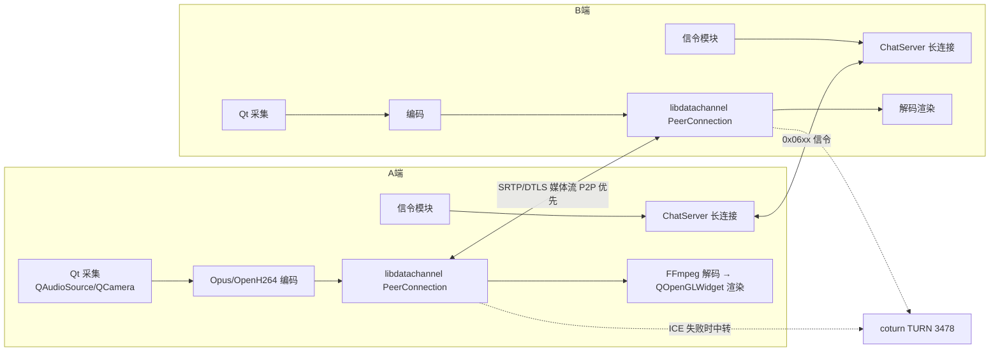
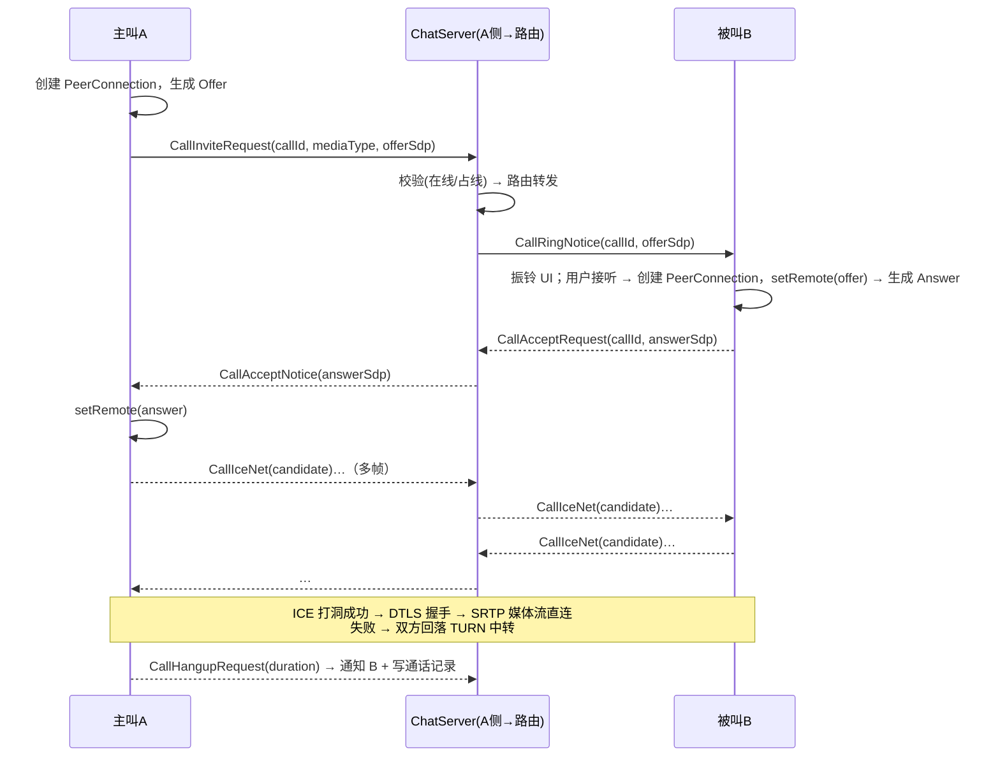

# 05 音视频通话设计

> 版本：v1.0 ｜ 选型：libdatachannel（WebRTC）+ Opus + OpenH264 + FFmpeg 解码渲染（ADR-003）
> 范围：首期 1v1 音频/视频通话；多人（SFU）与 AI 语音通话为扩展设计。

---

## 1. 总体结构：信令面与媒体面分离



- **信令面**：invite/accept/hangup/SDP/ICE 全部复用 ChatServer 长连接（0x06xx），
  天然获得在线路由、离线未接、跨节点转发能力；
- **媒体面**：SDP 交换完成后，媒体流在两个客户端之间直连（P2P），不经任何业务服务器；
  ICE 穿透失败时经 TURN 中转（媒体仍不落业务服务器）。

## 2. 通话状态机

```
                     ┌──────────┐ invite        ┌─────────┐ 被叫收到      ┌─────────┐
   idle ──发起──► calling ─────────────► ringing ──────────► connecting ──协商完成──► connected
                    │ 45s超时/取消        │ 拒绝/超时         │ 协商失败          │ 任一端挂断
                    ▼                    ▼                 ▼                 ▼
                  ended ◄────────────────┴─────────────────┴──────────────── ended
```

| 规则 | 值 |
| --- | --- |
| 振铃超时 | 45s 无人接 → 自动取消，写通话记录 state=0（未接） |
| 占线 | 被叫已在通话中 → CallReject(reason=busy)，主叫收提示 |
| 挂断 | 双方均可；携带 duration，服务端写 `t_call_record` |
| 唯一性 | 客户端同一时刻仅一路通话；服务端按 uid 校验 |
| 未接来电 | 被叫离线 → invite 暂存（Redis, TTL 60s），上线补推 → 记录 + 会话内系统消息 |

## 3. 信令时序（成功接通）



> SDP/ICE 用「邀请携带 offer」的预协商模式，接通即出画，体验优于「接通后再协商」。

## 4. WebRTC 关键概念在本项目的落点（面试考点）

| 概念 | 一句话 | 本项目落点 |
| --- | --- | --- |
| SDP Offer/Answer | 双方媒体能力（编解码/端口/参数）的协商文本 | libdatachannel 生成/消费，信令转发 |
| ICE Candidate | 本机/反射/中转三类候选地址 | 收集后经 0x0608 交换；本地(host)/STUN(srflx)/TURN(relay) |
| STUN | 打洞：探测公网映射地址 | coturn 兼职 STUN |
| TURN | 穿透失败时的媒体中转 | coturn（长期凭证鉴权） |
| DTLS-SRTP | 密钥协商 + 媒体加密 | libdatachannel 内置 |
| 打洞原理 | 双方同时向对方映射地址发包在 NAT 上开洞 | NAT 类型与穿透成功率矩阵（见 §7） |

## 5. 客户端媒体管线

```
采集：QAudioSource(48kHz 单声道 16bit, 20ms 帧) / QCamera(QVideoFrame 回调, 640×360@24fps)
编码：Opus(语音 24kbps 自适应) / OpenH264(baseline, 500kbps 起步)
传输：libdatachannel Track(RTP 打包由库内完成)
解码：对端 RTP → 库内解包 → FFmpeg(avcodec h264/opus) 解码
渲染：音频 → QAudioSink 直出；视频帧 → YUV→RGB → QOpenGLWidget(着色器) 或 QImage(小窗降级)
```

- 线程模型：采集线程（Qt 采集回调）→ 编码线程 → 发送（libdatachannel 内部线程）；
  接收侧解码放独立线程，渲染帧经队列投递 UI 线程，丢帧保最新（队列深度 2）；
- 设备失败降级：无摄像头 → 仅音频；编码失败 → 提示并挂断。

## 6. 弱网与质量

- 首期基线：Opus 内置自适应 + H264 关键帧请求（PLI）；RTT/丢包率经 RTCP 读取并展示（调试面板）；
- 码率自适应：丢包 >10% 降目标码率一档（500k→300k→150k，下限音频优先），恢复后缓慢回升；
- 已知边界：多网卡/对称型 NAT 场景依赖 TURN；移动网络切换导致的重协商首期不做（挂断重拨）。

## 7. NAT 穿透成功率与 TURN 兜底（知识储备）

| 主叫\被叫 | 全锥型 | 受限锥型 | 端口受限锥 | 对称型 |
| --- | --- | --- | --- | --- |
| 全锥型 | ✅ | ✅ | ✅ | ✅ |
| 受限锥型 | ✅ | ✅ | ✅ | ⚠ 需打洞技巧 |
| 端口受限锥 | ✅ | ✅ | ⚠ | ❌ |
| 对称型 | ✅ | ⚠ | ❌ | ❌ |

结论：对称型 NAT 之间无法直连 → 必须部署 TURN（预计 10%~20% 通话走中转，企业内网常见）。

## 8. TURN 服务器部署（coturn，M5）

```
# Windows 开发期用 Docker 或 WSL2 运行 coturn；配置要点：
listening-port=3478
fingerprint
lt-cred-mech                     # 长期凭证
static-auth-secret=<与 AIServer/ChatServer 共享的密钥>   # 客户端向信令侧换取临时凭证
realm=lingxi.im
# 生产：5349 TLS + 外网 IP 映射 external-ip
```

- 凭证下发：CallAccept/CallRing 时服务端按 HMAC 生成 10 分钟有效的 TURN 临时用户名密码
  （REST API 规范，time-limited credentials），凭证不硬编码进客户端；
- 部署形态：开发期单机 Docker；生产独立节点，按地域多实例。

## 9. AI 语音通话（扩展设计）

- 复用全部信令；被叫为 AI 时策略：1~2s 延迟自动接听（拟真）；
- 媒体对端是 AIServer 的虚拟 PeerConnection（服务端接入 libdatachannel）：
  下行音频 = 流式 TTS 音频帧；上行音频 = AIServer 侧 ASR（首期云端 ASR API）；
- 打断机制：检测用户持续说话（VAD）→ 停止 TTS 队列 → 转入新一轮 LLM 请求；
- 通话结束生成消息摘要（「语音通话 12 分钟，你们聊到了…」）写入会话，保持记忆连续性。
- 详见 04 文档 §11.2，实现排期在 M8 之后。

## 10. 测试与验收要点（与 07 文档联动）

| 用例 | 预期 |
| --- | --- |
| 同机双客户端（localhost）音视频通话 | 接通 ≤3s，音视频流畅 |
| 同局域网两台设备 | P2P 直连（relay=false） |
| 一端在手机热点（对称 NAT） | 走 TURN 中转，通话可用 |
| 通话中禁用对端麦克风 | 音频静音不中断，UI 状态正确 |
| 45s 未接 | 自动取消 + 通话记录 state=0 |
| 通话中断网 30s | 连接判死 → 双方 ended，记录 state=4 |
| AI 通话（扩展） | 自动接听、可打断、挂断后有摘要消息 |
