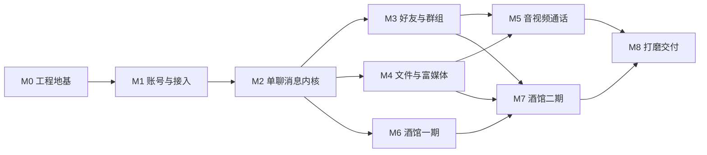

# 06 任务流与里程碑

> 版本：v1.0 ｜ 编号规则：`T{里程碑号}{序号}`，如 `T20-03`。
> 执行约定：每个任务完成必须 ①代码含 Doxygen 注释 ②对应单测/联调记录归档 `docs/tests/` ③devlog 追加一条。

## 0. 依赖关系总图



> 可并行点：M3/M4 可交叉推进；M6 依赖 M2（消息内核）而非 M5；T00-06（连接池）提前到 M0 是
> 后续所有服务端任务的地基。

---

## M0 工程地基（预估 1 周）

**目标**：任何人 clone 后一条命令构建全工程并跑通测试；公共库就绪。

| 任务 | 内容 | 依赖 | 产出 |
| --- | --- | --- | --- |
| T00-01 | 安装 vcpkg 并接入 VS 自带 CMake（PATH/工具链文件）；`cmake --version` 可用 | - | 环境就绪说明写入 README §6 |
| T00-02 | 仓库骨架：根 CMakeLists、vcpkg.json、目录树（01 文档 §8）、.clang-format/.editorconfig/.gitignore、`git init` 首提交 | - | 仓库骨架 |
| T00-03 | 编译链验证：Qt 5.12.11（msvc 套件）+ VS 编译运行 Qt Hello；Boost 1.90 asio 同步 echo server 编译运行 | T00-02 | 两个 demo + devlog 记录编译参数 |
| T00-04 | common 库 ①：Logger(spdlog 封装)、Config(json + *.local.json 覆盖)、NonCopyable/Singleton | T00-02 | common/include + 单测 |
| T00-05 | common 库 ②：BufReader/BufWriter(12 字节帧解析)、ThreadPool、雪花 IdGenerator、Uuid、时间工具 | T00-02 | + 粘包/半包单测（02 文档 §1） |
| T00-06 | common 库 ③：MySQL 连接池(Connector C++ 8.3)、Redis 连接池(hiredis)、健康检查 | T00-04 | + 单测（连接本机 MySQL/Redis） |
| T00-07 | proto v0：02 文档 §3 全部消息定义 + protoc 生成脚本（cmake 集成） | T00-02 | proto/*.proto + 生成产物 |
| T00-08 | GTest 接入 + 一键脚本：`build.bat`（配置+编译+测试）与 `test.bat` | T00-04 | 全量单测绿 |

**验收标准**：`build.bat` 一键从零构建成功；echo demo 回环测试通过；连接池/BufReader 单测通过。

## M1 账号与接入（预估 1~2 周）

**目标**：注册→登录→长连接建立→顶号踢出全链路可用，客户端有登录界面。

| 任务 | 内容 | 依赖 | 产出 |
| --- | --- | --- | --- |
| T10-01 | GateServer：Beast HTTP 框架（极简路由/JSON 工具/统一错误响应/IP 限流） | T00-04 | gateserver 可运行 |
| T10-02 | 注册接口：用户名查重、salt+SHA256、t_user 落库；防重放(ts+nonce) | T10-01, T00-06 | + Postman/curl 用例记录 |
| T10-03 | StatusServer：RPC 服务端框架 + 服务注册表 + 心跳摘除 + AllocateChatServer + HMAC token 签发/校验 | T00-05 | statusserver 可运行 |
| T10-04 | 自研 RPC 客户端侧：连接池/requestId 匹配/3s 超时/幂等重试（01 文档 §4） | T10-03 | common/rpc 库 |
| T10-05 | 登录接口：密码校验 → RPC 分配 ChatServer → 返回 token+host+port；写 t_login_session | T10-02~04 | 登录全链路 |
| T10-06 | ChatServer 骨架：TCP 接入 + LoginRequest 校验(RPC) + 连接管理 + route:uid 写入 + 顶号 KickUid | T10-04 | chatserver 接入可用 |
| T10-07 | 客户端网络层：HttpManager（注册/登录）+ TcpClient（连接/心跳/指数退避重连/分包） | T00-05 | client/net |
| T10-08 | 客户端 UI：登录窗/注册窗/主面板骨架（空会话列表） | T10-07 | 可登录进主界面 |
| T10-09 | 联调：01 文档 §5.1 时序逐帧核对（抓包/日志）+ simbot v0（单机器人登录脚本） | 全部 | 联调记录 |

**验收标准**：时序与 01 §5.1 完全一致；错误密码/失效 token/重复登录顶号三组异常用例通过。

## M2 单聊消息内核（预估 2 周）——全项目可靠性基石

| 任务 | 内容 | 依赖 | 产出 |
| --- | --- | --- | --- |
| T20-01 | 会话模型：t_conversation/member 落库；单聊 member_key 复用建会话 | M1 | + 单测 |
| T20-02 | 发送管线：幂等去重(Redis+唯一键) → seq INCR → 落库 → MessageAck（02 R1/R2/R6） | T20-01 | + 并发单测 |
| T20-03 | 投递：本机直推 / 跨节点 RpcPushToUid / 离线跳过（靠补拉） | T20-02 | 双 ChatServer 跨节点联调 |
| T20-04 | 漫游与补拉：SyncRequest/Response 分页 + seq 空洞检测触发定点补拉（02 R3/R4） | T20-02 | + 用例 |
| T20-05 | 已读回执与未读数（last_seq - last_read_seq 推导） | T20-03 | + 用例 |
| T20-06 | 撤回（2 分钟校验、双方删除语义）+ TypingNotice | T20-03 | + 用例 |
| T20-07 | 客户端：ChatWindow v1（气泡/重发/时间分割）+ SQLite 消息与会话缓存 + 启动增量同步 | T20-04 | 可日常聊天 |
| T20-08 | simbot v1：多机器人、可脚本化用例（乱序注入/断线补拉/重复发送） | T20-08 | tools/simbot |
| T20-09 | 压测基线：1000 连接 × 10msg/s × 10min；P99 延迟、丢失率、服务端内存记录 | T20-08 | docs/tests/ 压测报告 v1 |

**验收标准**：02 文档 R1~R8 全部规则有对应自动化用例且全绿；补拉语义在任何断网时机下不丢不重。

## M3 好友与群组（预估 2 周）

| 任务 | 内容 | 依赖 | 产出 |
| --- | --- | --- | --- |
| T30-01 | 好友：搜索/申请(t_friend_apply 状态机+7 天过期)/同意/拒绝/删除（双向）+ 全通知推送 | M2 | + 边界用例 |
| T30-02 | 好友列表/备注/分组；在线状态变更通知（route 表变化时推送） | T30-01 | + 用例 |
| T30-03 | 群：建群/邀请(免确认)/退群/踢人/解散/资料修改 + conv:members 缓存维护 | M2 | + 用例 |
| T30-04 | 群消息写扩散（ADR-006）+ 群未读一致性 | T30-03 | 三人群扇出用例 |
| T30-05 | 客户端：联系人面板（分组/申请红点/搜索）+ 群 UI（成员/设置/公告） | T30-01~03 | UI 完整 |
| T30-06 | 联调：好友全流程双端用例；三人群消息顺序一致性（seq 相同快照） | 全部 | 联调记录 |

**验收标准**：申请过期、自加好友、重复申请、非好友私信被拒等边界用例全绿。

## M4 文件与富媒体（预估 2 周）

| 任务 | 内容 | 依赖 | 产出 |
| --- | --- | --- | --- |
| T40-01 | FileServer：preflight(秒传/块位图) → 分块上传(4MB) → complete(MD5 校验合并) | M1, ADR-007 | fileserver 可用 |
| T40-02 | 下载：短时效签名 URL + Range 断点续传；缩略图生成 | T40-01 | + 用例 |
| T40-03 | 消息扩展：MSG_IMAGE/VOICE/VIDEO/FILE 收发与持久化（复用 0x03xx） | T20-02 | + 用例 |
| T40-04 | 客户端：拖拽/进度/续传 UI、图片查看器、语音录制(Opus)与播放、视频缩略图(FFmpeg) | T40-01~03 | 富媒体体验 |
| T40-05 | 本地缓存 LRU 上限 + 过期清理；FileServer 磁盘配额与孤儿文件清理任务 | T40-04 | 清理脚本 |
| T40-06 | 用例：1GB 文件中途断网续传不重不丢；秒传命中；word/pdf/md 往返打开 | 全部 | 记录归档 |

**验收标准**：断点续传/秒传/Range 三类用例通过；100MB 内文件 P95 上传耗时 < 局域网带宽理论值的 1.5 倍。

## M5 音视频通话（预估 2~3 周）

| 任务 | 内容 | 依赖 | 产出 |
| --- | --- | --- | --- |
| T50-01 | 通话信令全套（02 §0x06xx）+ 状态机 + 占线/超时/未接补推 + t_call_record | M3 | 信令联调 |
| T50-02 | libdatachannel 接入（vcpkg）+ PeerConnection 封装 + TURN 临时凭证下发（05 §8） | T00-01 | demo 双端握手 |
| T50-03 | 音频管线：QAudioSource → Opus → 传输 → 解码 → QAudioSink；1v1 语音端到端 | T50-02 | 语音通话可用 |
| T50-04 | 视频管线：QCamera → OpenH264 → 传输 → FFmpeg 解码 → QOpenGLWidget 渲染 | T50-03 | 视频通话可用 |
| T50-05 | coturn 部署（Docker）+ 中转场景验证（05 §8） | T50-02 | relay 场景可用 |
| T50-06 | 调试面板（RTT/丢包/码率/relay 标志）+ 丢包降档策略（05 §6） | T50-04 | 可观测 |
| T50-07 | 05 文档 §10 用例全表执行并记录 | 全部 | 记录归档 |

**验收标准**：localhost 与局域网 P2P 接通 ≤3s；TURN 中转场景可用；异常路径（拒接/超时/断网）状态正确。

## M6 酒馆一期（预估 2~3 周）

| 任务 | 内容 | 依赖 | 产出 |
| --- | --- | --- | --- |
| T60-01 | AIServer 骨架：RPC 接入 + 任务队列 + ai:pending 崩溃恢复扫描（04 §6） | T10-04 | aiserver 可运行 |
| T60-02 | LlmGateway：ILlmProvider + OpenAiCompatibleProvider(SSE/Beast) + 重试/降级/限流/用量统计 | T60-01 | 网关单测（mock server） |
| T60-03 | 角色卡：PNG tEXt chunk 解析/导入/导出 + 建档流程（04 §2） | T60-01 | + 单测（标准卡/坏卡） |
| T60-04 | ChatServer AI 分流：user_type=1 → RpcSubmitChat + 占位 seq 消息（04 §6） | T60-01 | 分流用例 |
| T60-05 | PromptBuilder：人设区/世界书接口/窗口裁剪/token 预算/输出契约（04 §5） | T60-02 | + 快照单测 |
| T60-06 | 流式下发：Chunk/End/Typing + 占位改写 + affinity 标记解析剥离 | T60-04, T60-05 | 全链路流式 |
| T60-07 | 世界书：entries 模型 + 注入算法（触发/次级词/优先级/预算，04 §4）+ 编辑器 UI | T60-05 | + 注入算法单测 |
| T60-08 | Swipe：AiSwipeRequest 全套 + versions 存储 + 客户端滑动切换 UI（04 §10） | T60-06 | + 用例 |
| T60-09 | 客户端：角色卡编辑器（表单/立绘裁剪）+ AI 聊天体验（打字机/好感度侧栏 v0） | T60-06~08 | 可玩 |
| T60-10 | 兼容性：导入 3 张社区 SillyTavern PNG 卡 → 对话 → 导出 → 回 ST 复导入成功 | T60-03 | 记录归档 |

**验收标准**：SillyTavern 卡片双向兼容；连续 10 分钟流式对话无错乱/丢分片（以 End 全文校验）。

## M7 酒馆二期（预估 2 周）

| 任务 | 内容 | 依赖 | 产出 |
| --- | --- | --- | --- |
| T70-01 | 记忆：摘要任务（阈值/锁/幂等）+ facts 抽取 + 「TA 的记忆」侧栏（04 §7） | M6 | + 用例 |
| T70-02 | 好感度：结算/阶段升级系统通知/限幅防刷 + 语气注入（04 §8） | M6 | + 用例 |
| T70-03 | 剧情群：type=4 + 共享世界书 + 导演调度（LLM 选人/beat/规则兜底）+ 旁白/OOC（04 §9） | T70-01 | 三人群演绎 demo |
| T70-04 | TTS：ITtsProvider + 合成上传 + MSG_VOICE(aiGen) + 角色音色配置（04 §11） | M4, M6 | 语音消息用例 |
| T70-05 | 广场：公开角色索引/推荐流/名片转发一键添加（04 §2.3） | M6, T30-01 | 发现页可用 |
| T70-06 | 用例：剧情群 20 轮演绎稳定；摘要后 AI 仍记得早期约定；好感度升级通知触达 | 全部 | 记录归档 |

**验收标准**：四大玩法（角色卡/剧情群/记忆好感度/Swipe+TTS）全部可端到端演示。

## M8 打磨与交付（预估 1~2 周）

| 任务 | 内容 | 依赖 | 产出 |
| --- | --- | --- | --- |
| T80-01 | 安全加固：全接口越权矩阵用例（uid 归属校验）、限流参数、敏感词回归 | M7 | 安全用例记录 |
| T80-02 | 压测终版：3000 连接混合负载（文本 80%/图片 15%/文件 5%），P99 报告 + 慢查询 explain 优化记录 | T20-09 | 压测报告终版 |
| T80-03 | 稳定性：simbot 7×24 挂机，内存/句柄/连接数曲线，泄漏定位与修复 | T20-08 | 稳定性报告 |
| T80-04 | 打包交付：WinDeployQt + Inno Setup 安装包；服务端一键启动/停止脚本；部署文档 | 全部 | release 产物 |
| T80-05 | 文档终审：全部文档与实现一致性核对（协议表/DDL/时序逐项对码） | 全部 | 文档 v2.0 |
| T80-06 | Android 端评估：协议复用清单、Qt for Android vs 原生(Kotlin+protobuf) 对比、工作量估算 | - | 评估文档 |
| T80-07 | 面试题库终审：结合本项目实现细节补全答案（引用代码位置） | 全部 | 08 文档 v2 |

## 工期汇总与关键路径

```
关键路径：M0 → M1 → M2 → M6 → M7 → M8        （约 10~12 周）
可并行支线：M3 → M5（音视频支线，约 4~5 周，与 M4/M6 并行）
```

- 全职投入估算 12~14 周；学习型节奏（半天编码半天整理文档）估算 16~18 周；
- 里程碑完成即打 tag（`v0.1-m1` …），并要求该里程碑全部测试记录归档后才算关闭。
